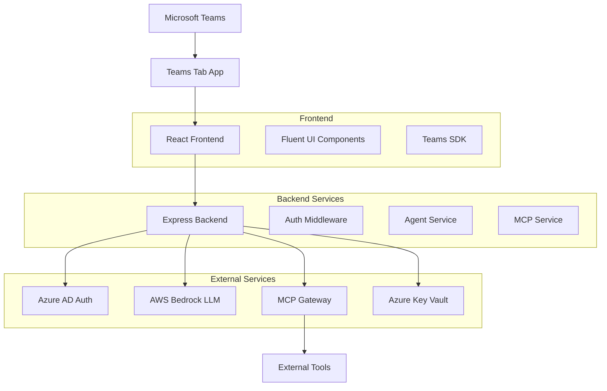

# Microsoft Teams AI Agent Tab App with MCP Gateway Integration

[](https://github.com/yourusername/microsoft-teams-ai-agent-mcp)
[](https://docs.microsoft.com/en-us/microsoftteams/platform/)
[](https://aws.amazon.com/bedrock/)
[](https://azure.microsoft.com/en-us/services/active-directory/)

A production-ready Microsoft Teams Tab-based application that embeds an AI Agent powered by AWS Bedrock LLMs and orchestrates tool execution via Topcoder MCP Gateway. Features Azure AD SSO, streaming responses, and enterprise-grade security.

## 🚀 Features

### ✅ **Microsoft Teams Integration**
- **Teams Tab App** with static and configurable tabs
- **Azure AD SSO** authentication with tenant isolation
- **Teams SDK** integration for seamless user experience
- **Responsive UI** built with React and Fluent UI

### ✅ **AI Agent Capabilities**
- **AWS Bedrock** integration with Claude 3 Sonnet
- **Streaming responses** for real-time user interaction
- **LangChain integration** for AI orchestration
- **Conversation memory** and context management
- **Tool selection** and execution via AI reasoning

### ✅ **MCP Gateway Integration**
- **Tool discovery** and execution through MCP Gateway
- **Batch tool execution** for complex workflows
- **Rich result visualization** with adaptive cards
- **Environment-aware** configuration (dev/test/prod)
- **Error handling** and retry mechanisms

### ✅ **Enterprise Security**
- **Azure Key Vault** secrets management
- **No hardcoded secrets** - all sensitive data encrypted
- **Environment variable validation** at startup
- **JWT token validation** for secure API access
- **Rate limiting** and security headers

### ✅ **User Experience**
- **ChatGPT-like interface** with streaming responses
- **Chat history** with search and filtering
- **Tool result visualization** with structured data
- **Error boundaries** for graceful error handling
- **Loading states** and progress indicators

## 🏗️ Architecture



## 🚀 Quick Start

### Prerequisites
- Node.js 18+ and npm
- Azure AD application registration
- AWS Bedrock access
- MCP Gateway credentials

### Installation

1. **Clone the repository**
   ```bash
   git clone https://github.com/yourusername/microsoft-teams-ai-agent-mcp.git
   cd microsoft-teams-ai-agent-mcp
   ```

2. **Install dependencies**
   ```bash
   npm run install:all
   ```

3. **Configure environment**
   ```bash
   cp env.example .env
   # Edit .env with your actual values
   ```

4. **Build for production**
   ```bash
   npm run deploy:prod
   ```

5. **Start the server**
   ```bash
   npm start
   ```

## 📱 Teams App Deployment

### 1. Build Teams Manifest
```bash
npm run build:manifest
```

### 2. Create App Package
```bash
mkdir teams-app-package
cp teams-app-manifest-built.json teams-app-package/manifest.json
cp icons/color.png teams-app-package/
cp icons/outline.png teams-app-package/
cd teams-app-package
zip -r ../teams-ai-agent-app.zip .
```

### 3. Upload to Teams
1. Go to Teams Admin Center
2. Navigate to Teams apps → Manage apps
3. Click "Upload" → "Upload a custom app"
4. Select your app package
5. Configure permissions and publish

## 🔧 Configuration

### Environment Variables

| Variable | Description | Required |
|----------|-------------|----------|
| `AZURE_TENANT_ID` | Azure AD tenant ID | ✅ |
| `AZURE_CLIENT_ID` | Azure AD application ID | ✅ |
| `AZURE_CLIENT_SECRET` | Azure AD application secret | ✅ |
| `AWS_REGION` | AWS region for Bedrock | ✅ |
| `AWS_ACCESS_KEY_ID` | AWS access key | ✅ |
| `AWS_SECRET_ACCESS_KEY` | AWS secret key | ✅ |
| `BEDROCK_MODEL` | Bedrock model ID | ✅ |
| `MCP_GATEWAY_URL` | MCP Gateway endpoint | ✅ |
| `MCP_API_KEY` | MCP Gateway API key | ✅ |
| `TEAMS_APP_ID` | Teams application ID | ✅ |
| `BASE_URL` | Application base URL | ✅ |

### Azure Key Vault Integration

The application supports Azure Key Vault for secure secrets management:

```bash
# Set Key Vault environment variables
export AZURE_KEY_VAULT_URL="https://your-vault.vault.azure.net/"
export AZURE_CLIENT_ID="your-client-id"
export AZURE_CLIENT_SECRET="your-client-secret"
export AZURE_TENANT_ID="your-tenant-id"
```

## 🚀 Deployment Options

### Docker Deployment
```bash
docker-compose up -d
```

### Azure App Service
```bash
npm run deploy:azure
```

### AWS ECS
```bash
npm run deploy:aws
```

### Kubernetes
```bash
kubectl apply -f k8s/
```

## 📚 Documentation

- [Architecture Guide](docs/ARCHITECTURE.md) - System architecture and design
- [Deployment Guide](docs/DEPLOYMENT.md) - Deployment instructions
- [User Guide](docs/USER_GUIDE.md) - End-user documentation
- [Production Ready](PRODUCTION-READY.md) - Production deployment guide

## 🧪 Testing

```bash
# Run all tests
npm test

# Run with coverage
npm run test:coverage

# Run integration tests
npm run test:integration
```

## 🤝 Contributing

1. Fork the repository
2. Create a feature branch (`git checkout -b feature/amazing-feature`)
3. Commit your changes (`git commit -m 'Add some amazing feature'`)
4. Push to the branch (`git push origin feature/amazing-feature`)
5. Open a Pull Request

## 📄 License

This project is licensed under the MIT License - see the [LICENSE](LICENSE) file for details.

## 🏆 Topcoder Challenge

This project was developed for the **Microsoft Teams AI Agent Tab App with MCP Gateway Integration** challenge on Topcoder.

### ✅ Acceptance Criteria Met
- ✅ App installs as a tab in Teams and authenticates using Azure AD
- ✅ Users can enter prompts and receive streaming AI responses
- ✅ At least 2 external MCP tools are integrated and callable via the agent
- ✅ Secrets are securely stored and never hardcoded
- ✅ Deployment is reproducible manually via documented steps

## 🙏 Acknowledgments

- Microsoft Teams Platform
- AWS Bedrock
- LangChain
- Topcoder MCP Gateway
- Azure AD
- Fluent UI

## 📞 Support

For support and questions:
- Create an issue in this repository
- Contact the development team
- Check the documentation

---

**Built with ❤️ for the Topcoder community**
